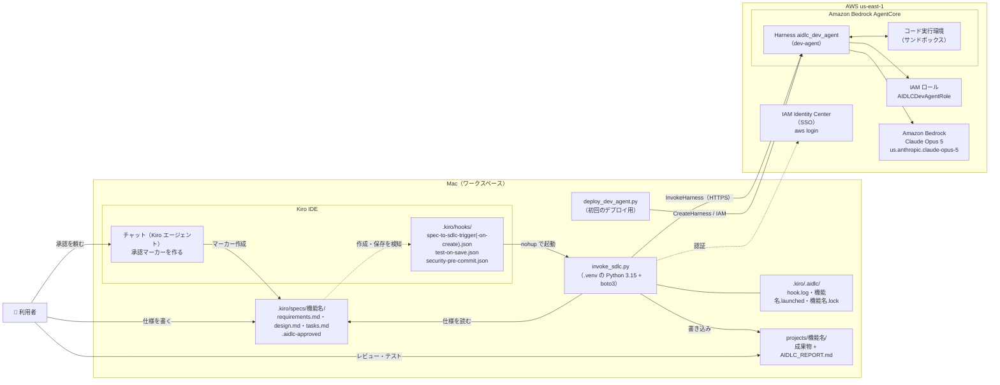
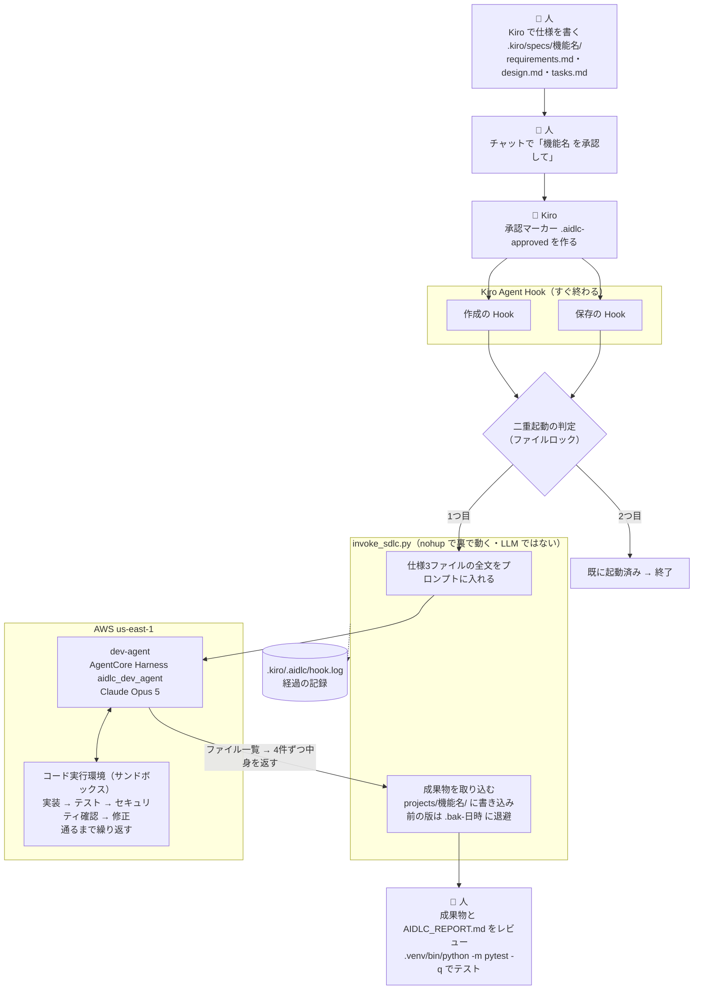

# 最小構成の AI-DLC の図

図として見るには、このファイルを開いた状態でコマンドパレットから **Kiro: Review Markdown** を実行してください。

## 構成図

何がどこにあるか（Mac と AWS）を示します。

```mermaid
flowchart LR
    U["👤 利用者"]

    subgraph MAC["Mac（ワークスペース）"]
        subgraph KIRO["Kiro IDE"]
            CHAT["チャット（Kiro エージェント）<br/>承認マーカーを作る"]
            HOOKS[".kiro/hooks/<br/>spec-to-sdlc-trigger(-on-create).json<br/>test-on-save.json<br/>security-pre-commit.json"]
        end
        SPEC[".kiro/specs/機能名/<br/>requirements.md・design.md・tasks.md<br/>.aidlc-approved"]
        INV["invoke_sdlc.py<br/>（.venv の Python 3.15 + boto3）"]
        STATE[".kiro/.aidlc/<br/>hook.log・機能名.launched・機能名.lock"]
        PROJ["projects/機能名/<br/>成果物 + AIDLC_REPORT.md"]
        DEP["deploy_dev_agent.py<br/>（初回のデプロイ用）"]
    end

    subgraph AWS["AWS us-east-1"]
        SSO["IAM Identity Center（SSO）<br/>aws login"]
        subgraph AC["Amazon Bedrock AgentCore"]
            HAR["Harness aidlc_dev_agent<br/>（dev-agent）"]
            CI["コード実行環境<br/>（サンドボックス）"]
        end
        ROLE["IAM ロール<br/>AIDLCDevAgentRole"]
        MODEL["Amazon Bedrock<br/>Claude Opus 5<br/>us.anthropic.claude-opus-5"]
    end

    U -- "仕様を書く" --> SPEC
    U -- "承認を頼む" --> CHAT
    CHAT -- "マーカー作成" --> SPEC
    SPEC -. "作成・保存を検知" .-> HOOKS
    HOOKS -- "nohup で起動" --> INV
    INV -- "仕様を読む" --> SPEC
    INV --- STATE
    INV -- "書き込み" --> PROJ
    U -- "レビュー・テスト" --> PROJ

    INV -- "InvokeHarness（HTTPS）" --> HAR
    DEP -- "CreateHarness / IAM" --> HAR
    INV -. "認証" .-> SSO
    HAR --> ROLE
    HAR --> MODEL
    HAR <--> CI
```

## 仕組みの図

承認してから成果物ができるまでの処理の順番を示します。

```mermaid
flowchart TD
    H1["👤 人<br/>Kiro で仕様を書く<br/>.kiro/specs/機能名/<br/>requirements.md・design.md・tasks.md"]
    H2["👤 人<br/>チャットで「機能名 を承認して」"]
    K["🤖 Kiro<br/>承認マーカー .aidlc-approved を作る"]

    subgraph HOOK["Kiro Agent Hook（すぐ終わる）"]
        HC["作成の Hook"]
        HS["保存の Hook"]
    end

    L{"二重起動の判定<br/>（ファイルロック）"}
    SKIP["既に起動済み → 終了"]

    subgraph LOCAL["invoke_sdlc.py（nohup で裏で動く・LLM ではない）"]
        S1["仕様3ファイルの全文をプロンプトに入れる"]
        S4["成果物を取り込む<br/>projects/機能名/ に書き込み<br/>前の版は .bak-日時 に退避"]
    end

    subgraph AWS["AWS us-east-1"]
        D["dev-agent<br/>AgentCore Harness aidlc_dev_agent<br/>Claude Opus 5"]
        SB["コード実行環境（サンドボックス）<br/>実装 → テスト → セキュリティ確認 → 修正<br/>通るまで繰り返す"]
    end

    LOG[(".kiro/.aidlc/hook.log<br/>経過の記録")]
    R["👤 人<br/>成果物と AIDLC_REPORT.md をレビュー<br/>.venv/bin/python -m pytest -q でテスト"]

    H1 --> H2 --> K
    K --> HC & HS
    HC --> L
    HS --> L
    L -- 1つ目 --> S1
    L -- 2つ目 --> SKIP
    S1 --> D
    D <--> SB
    D -- "ファイル一覧 → 4件ずつ中身を返す" --> S4
    S4 --> R
    LOCAL -.-> LOG
```
